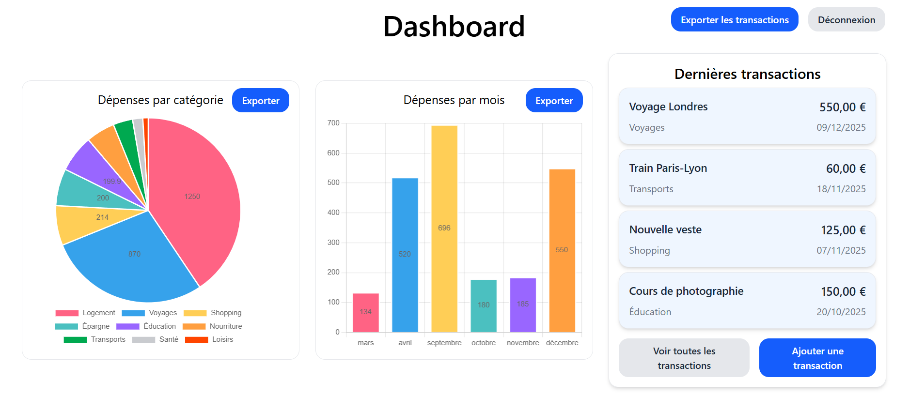

# Xpense

Xpense est une application de gestion de dépenses personnelles qui permet aux utilisateurs de suivre leurs transactions, gérer leurs budgets et visualiser l’historique de leurs dépenses facilement.

## Table des matières
1. [À propos du projet](#à-propos-du-projet)
2. [Technologies utilisées](#technologies-utilisées)
3. [Installation](#installation)
   - [Backend](#backend)
   - [Frontend](#frontend)
4. [Configuration](#configuration)
5. [Utilisation](#utilisation)
6. [Structure du projet](#structure-du-projet)
7. [API](#api)
8. [Démo](#démo)

## À propos du projet

Xpense a été créé pour aider les utilisateurs à mieux gérer leurs finances personnelles. Grâce à une interface simple et intuitive, l’application permet de :
- Ajouter, modifier et supprimer des dépenses
- Consulter un historique des transactions
- Visualiser les dépenses par catégorie et période

Les fonctionnalités ont été développées à partir des [user stories](doc/UserStories.md) définies au départ.

## Technologies utilisées

### Backend
- Langage / Framework : Java 21, Spring Boot
- Base de données : PostgreSQL
- Sécurité : Spring Security, JWT
- ORM : JPA / Hibernate

### Frontend
- Framework : Angular 20
- Langages : TypeScript, HTML, CSS
- UI : Tailwind CSS
- Communication avec le backend : HttpClient

## Installation

### Backend
1. Cloner le dépôt.
2. Aller dans le dossier *back*.
3. Configurer les variables d’environnement dans application.properties ou .env :
    - DB_URL : URL de la base de données
    - DB_USER : nom d’utilisateur
    - DB_PASSWORD : mot de passe
    - JWT_SECRET : clé secrète pour les tokens JWT
4. Lancer le backend avec Maven ou via ton IDE : ./mvnw spring-boot:run

### Frontend
1. Aller dans le dossier *front*.
2. Installer les dépendances avec `npm install`.
3. Lancer le serveur de développement avec `ng serve`.
4. Accéder à l’application dans le navigateur : http://localhost:4200.

## Configuration
Avant de lancer l’application :
- S'assurer que PostgreSQL est installé et que la base de données Xpense existe.
- Modifier si besoin le fichier *application.properties* pour indiquer le username et le password associés à la base de donnée.
- Vérifie que le port backend (8080) et frontend (4200) ne sont pas utilisés.

## Utilisation
- Créer un compte utilisateur via la page d’inscription.
- Se connecter avec ses identifiants.
- Ajouter des dépenses avec montant, catégorie et date.
- Consulter le tableau de bord pour visualiser l’historique et le budget.
- Modifier ou supprimer des dépenses si nécessaire.

Pour plus de détails sur l'utilisation du projet, se référer à la [Documentation utilisateur](doc/DocUtilisateur.md).

## Structure du projet

### Backend

Le backend est organisé sous forme d’API REST. Les **controllers** reçoivent les requêtes HTTP et les transmettent aux **services** correspondants, qui contiennent la logique métier. Les **repositories** se chargent de l’accès aux données, en communiquant avec la base via JPA.

### Frontend

Le frontend est développé avec Angular en utilisant uniquement des composants standalone. Chaque **composant** affiche une vue spécifique et gère les interactions avec l’utilisateur. Les **services** permettent de communiquer avec le backend via HTTP pour récupérer ou envoyer des données.

### API
Voici les principaux endpoints du backend :
- POST /api/auth/login : connexion utilisateur
- GET /api/transaction/all : récupérer toutes les dépenses de l’utilisateur connecté
- POST /api/transaction : ajouter une transaction (avec les informations associées)
- PUT /api/transaction/{id} : modifier une transaction existante
- DELETE /api/transaction/{id} : supprimer une transaction

Pour plus de détails sur la structure du projet, se référer à la [Documentation technique](doc/DocTechnique.md).

## Démo

Cliquer sur l'image ci-dessous pour accéder à une vidéo de démonstration de l'application.

